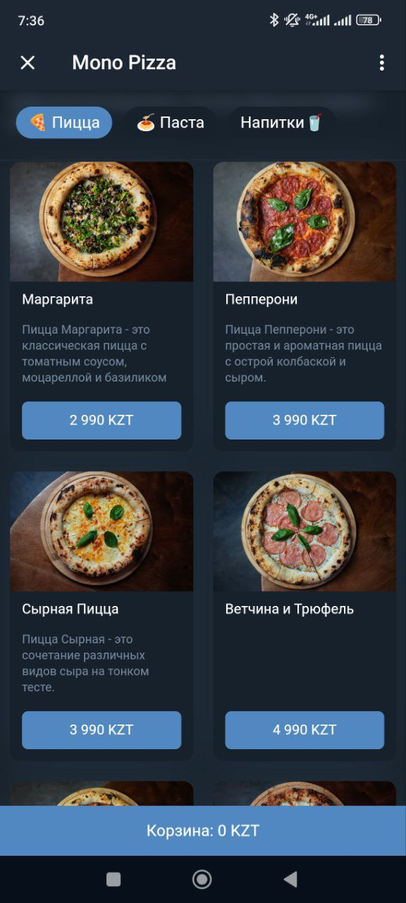
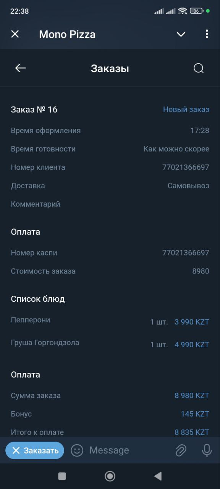
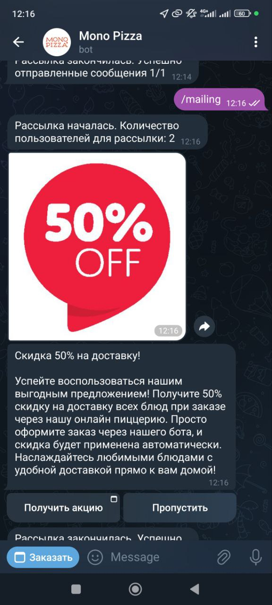

<p align="center">
  
</p>

# 🍽️ RESTOLAND — Telegram-бот для заказов в ресторане и системы лояльности


**RESTOLAND** — это мощный и удобный Telegram-бот, созданный для ресторанного бизнеса. Он позволяет клиентам просматривать меню, оформлять заказы, выбирать доставку или самовывоз, оплачивать прямо в чате и отслеживать статус заказов.

Также реализованы **система лояльности**, **промо-акции**, **рассылки** и **подробная аналитика**, что делает его полноценным цифровым решением для современных ресторанов.

## 🍕 Основные возможности

- **Поддержка нескольких точек**: Клиенты могут выбрать конкретный филиал ресторана для заказа.
- **Меню и оформление заказа**: Удобная навигация по меню и инлайн-заказ.
- **Интеграция оплаты**: Быстрая и безопасная оплата прямо в боте.
- **Отслеживание заказов**: Уведомления и статусы в реальном времени.
- **Система лояльности**: Баллы, промокоды и скидки.
- **Рассылки и промо-кампании**: Планирование и сегментация сообщений.
- **Аналитика**: Информация о заказах, клиентах и результатах рассылок.
- **Определение геопозиции**: Автоматическое определение и предложение ближайших точек.

## ⚙️ Технологии

- **Фреймворк Telegram-бота**: [`aiogram`](https://github.com/aiogram/aiogram) 3.x
- **Сетевые запросы**: `aiohttp`, `websockets`
- **Геолокация**: `geopy`
- **Планировщик задач**: `apscheduler` (для уведомлений, рассылок и автоматических действий)
- **Безопасность**: `cryptography` (для защиты данных и генерации платежных ссылок)
- **Конфигурация окружения**: `environs`

## 🚀 Запуск проекта

1. Клонируйте репозиторий:
   ```bash
   git clone https://github.com/NurzhanTng/foodsite_bot.git
   ```

2. Установите зависимости:
   ```bash
   pip install -r requirements.txt
   ```

3. Добавьте токен бота и конфигурации в файл `.env`:
   ```env
    BOT_TOKEN=your_token
    API_PATH=your_server
    SITE_PATH=path_to_bots_website
    PAYMENTS_TOKEN=payment_system_token
    WS_PATH=your_server_events_path
   ```

4. Запустите бота:
   ```bash
   python main.py
   ```

## 📸 Скриншоты

_Пример использования бота:_

<p align="center">
    
</p>
<p align="center"><i>Навигация по меню</i></p>

<p align="center"> 
     
</p>
<p align="center"><i>Уведомления о статусе заказа</i></p>

<p align="center">
      
</p>
<p align="center"><i>Промо-акции и система лояльности</i></p>

## 📎 Ссылки

- [English version of README.md](./README.md)

---

**RESTOLAND** — это open-source проект. Если у тебя есть идеи, предложения или ты хочешь помочь с разработкой — открывай issue или делай pull request. Улучшим ресторанный опыт вместе!
